<h3></h3>

A developer by profession but a gamer by heart. I have a passion for creating immersive experiences and innovative solutions. You can find me playing something cinema on my YouTube. Currently indulged in refining my skills and raging at FPS games. You might find me having a heart attack watching my favourite football team (Barcelona) play or watching cars go around in circles (F1).

Have an idea in mind? Let's talk: **[farhanjafri21@gmail.com](mailto:farhanjafri21@gmail.com)**

<h3></h3>

**Full stack** 

**Databases** 
 

**Machine learning** 

**Languages** 

**Design and tools** 

<h3></h3>

<picture>
  <source media="(prefers-color-scheme: dark)" srcset="https://raw.githubusercontent.com/farhanj21/farhanj21/output/snake-dark.svg" />
  <source media="(prefers-color-scheme: light)" srcset="https://raw.githubusercontent.com/farhanj21/farhanj21/output/snake-light.svg" />
  
</picture>

 
